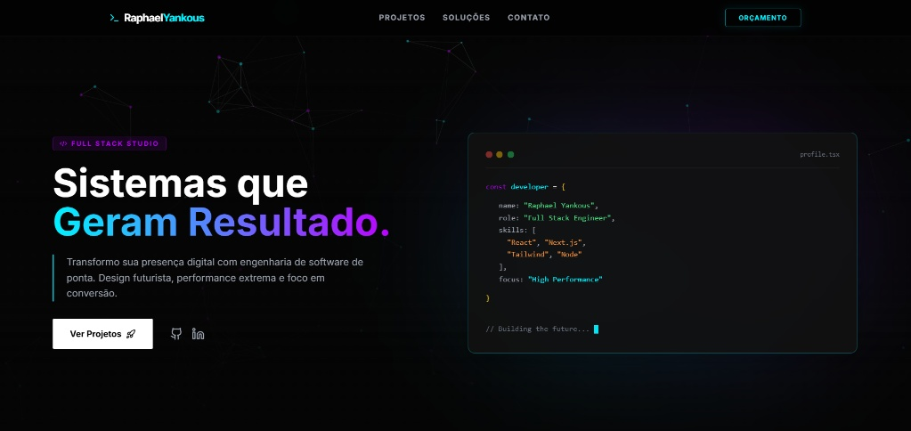

# 💻 DevStudio - Portfólio & Agência Digital

Este repositório contém o código-fonte do meu portfólio profissional (atuando como **DevStudio**), desenvolvido para apresentar soluções de engenharia de software de alta performance.

O projeto é uma **Landing Page** com estética "Ultra Tech" (Cyberpunk/Neon), projetada para transmitir autoridade técnica, atrair clientes B2B e exibir cases de sucesso com interatividade avançada.



## 🚀 Tecnologias Utilizadas

O projeto foi construído utilizando uma stack moderna focada em performance e experiência do usuário:

* **[React](https://react.dev/)**: Biblioteca JavaScript para construção de interfaces reativas.
* **[Vite](https://vitejs.dev/)**: Build tool de última geração para desenvolvimento ágil.
* **[Tailwind CSS](https://tailwindcss.com/)**: Framework utility-first para estilização responsiva e tema Dark Mode.
* **[Framer Motion](https://www.framer.com/motion/)**: Biblioteca para animações de entrada, scroll e micro-interações.
* **[tsParticles](https://particles.js.org/)**: Motor de partículas leve para o fundo dinâmico e tecnológico.
* **[Lucide React](https://lucide.dev/)**: Conjunto de ícones vetoriais modernos e consistentes.

## ✨ Destaques do Projeto

* **Identidade Visual Tech**: Paleta de cores Neon (`brand-primary: #00f2ff`, `brand-secondary: #bd00ff`) sobre fundo Dark profundo, reforçando a inovação.
* **Experiência Interativa (Hover)**: Cards de projetos que revelam **GIFs animados** automaticamente ao passar o mouse, simulando o uso real das aplicações.
* **Elemento 3D (Hero)**: Card flutuante com código (`profile.tsx`) na seção inicial, destacando a expertise em desenvolvimento.
* **Fundo Dinâmico**: Partículas conectadas (`tsparticles-slim`) reagindo ao mouse, criando imersão sem comprometer a performance.
* **Seções Estratégicas**:
    * **Hero**: Headline de autoridade com Call-to-Action (CTA) claro para orçamento.
    * **Soluções**: Grid de serviços (Design, Responsividade, Performance).
    * **Case Studies**: Galeria de projetos recentes (Engenharia, Educação, Finanças) com links externos.
    * **Rodapé**: Área de contato direta (WhatsApp/LinkedIn) e selo de desenvolvedor.

## 📂 Estrutura do Projeto

```bash
├── public/              # Arquivos estáticos (GIFs dos projetos, Favicon, Perfil)
├── src/
│   ├── assets/          # Assets vetoriais e imagens importadas
│   ├── App.jsx          # Componente principal (Lógica, Dados e Layout)
│   ├── index.css        # Configurações globais do Tailwind e Fontes
│   └── main.jsx         # Ponto de entrada da aplicação React
├── index.html           # HTML base com SEO e Meta Tags
├── tailwind.config.cjs  # Configuração de Cores da Marca (Brand Colors)
├── vite.config.js       # Configuração do Vite
└── package.json         # Dependências e scripts